# Proposal: Toast Menu Scraper v2 — GraphQL Interception

## Executive Summary

We propose replacing the current Toast menu scraper's HTML parsing approach with **GraphQL API interception** — capturing structured data directly from Toast's internal API instead of parsing rendered web pages.

**Why:** The current scraper is slow (30-90s per restaurant), fragile (50+ CSS selectors that break on UI updates), and incomplete (cannot extract nested modifiers or reliable stock status).

**What:** The new approach intercepts Toast's own GraphQL API responses during a single page load, then fetches modifier details via direct HTTP calls — no HTML parsing, no modal clicking, no CSS selectors.

**Results from proof of concept (tested across 4 restaurants):**

| Metric | Current | New | Change |
|--------|---------|-----|--------|
| Time per restaurant | 30-90s | 10-20s | **4x faster** |
| Browser active time | 60s | 5s | **12x less** |
| CSS selectors to maintain | 50+ | 0 | **Zero maintenance** |
| Nested modifier support | No | Yes | **New capability** |
| Data accuracy | Text parsing + regex | Exact values from API | **Higher quality** |

**Effort:** Core proof of concept is complete. Estimated 1-2 weeks remaining for database integration, Lambda deployment, and testing.

---

## Problem Statement

Our current Toast menu scraper relies on HTML parsing and browser automation to extract restaurant and menu data. While functional, this approach has significant operational challenges:

- **Slow**: 30-90 seconds per restaurant due to Cloudflare waits and sequential modal clicking
- **Fragile**: 50+ CSS selectors break whenever Toast updates their UI
- **Resource-heavy**: Requires a full Chromium browser instance for the entire scraping session
- **Incomplete**: Nested modifiers are detected but skipped; out-of-stock detection is unreliable

## Proposed Solution

Replace HTML parsing with **GraphQL API interception** — a two-phase approach that captures structured data directly from Toast's internal API.

---

## How the Current Scraper Works

1. Open a headless browser (Playwright + stealth plugin)
2. Navigate to the Toast restaurant page
3. Wait 15-60 seconds for Cloudflare challenge to resolve
4. Parse the rendered HTML using Cheerio with 50+ CSS selectors to extract restaurant info and menu items
5. For **every single menu item**, click it to open a modal dialog, wait for the modal to render, parse the modal HTML for modifier details, then close the modal
6. Transform the raw scraped text into a structured format (sanitize prices from strings, guess modifier relationships)
7. Save to database

**Current modifier extraction code** — clicks each item one by one:

```typescript
// For EVERY menu item, we must:
// 1. Find the item element by name
// 2. Scroll it into view
// 3. Click to open modal
// 4. Wait for modal to appear
// 5. Parse modal HTML for modifiers
// 6. Close modal
// 7. Repeat for next item

for (let i = 0; i < itemCount; i++) {
  const item = menuItems.nth(i);
  await item.scrollIntoViewIfNeeded();
  await item.click({ delay: 100 });

  // Wait for modal — if it doesn't appear, assume out of stock
  try {
    await page.waitForSelector('[data-testid="modal-content"]', { timeout: 5000 });
  } catch {
    continue; // item assumed out of stock
  }

  // Parse modal HTML with Cheerio
  const modalHtml = await page.evaluate(() => {
    return document.querySelector('[data-testid="modal-content"]')?.outerHTML;
  });

  // Extract modifiers from HTML using CSS selectors
  // These selectors break when Toast updates their UI
  const modGroups = $(modalHtml).find('.modSections .modSection');
  // ... parse each modifier group with more selectors ...

  // Close modal
  await page.locator('[data-testid="modal-close-button"]').click();
  await sleep(300);
}
```

**Key pain points:**

- Step 5 is sequential — a restaurant with 50 items means 50 modal clicks, each taking ~1 second
- Step 4 and 5 depend on specific CSS class names and DOM structure — any Toast UI update breaks everything
- If a modal fails to open, the item is assumed to be out of stock (unreliable)
- Nested modifiers (modifier options that themselves have sub-options) are detected but cannot be extracted
- Price extraction requires regex sanitization from strings like `"Extra Chicken (+$3.00)"`

---

## How the New Scraper Works

### Discovery: Toast's Internal GraphQL API

We discovered that Toast's frontend communicates with a GraphQL API at `ws-api.toasttab.com/do-federated-gateway/v1/graphql`. This API uses **persisted queries** — instead of sending raw GraphQL query strings, the frontend sends a SHA256 hash that maps to a pre-registered query on the server.

The key operations we intercept:

| Operation | Purpose | Data Returned |
|-----------|---------|---------------|
| `RestaurantByShortUrl` | Resolve a URL slug to restaurant GUID | Restaurant identity |
| `Restaurant` | Full restaurant details | Name, address, cuisine, hours, timezone |
| `PaginatedMenuItemsWithPopularItems` | All menus and items | Menus, groups, items with prices |
| `MenuItemDetails` | Modifier details for a single item | Modifier groups, options, nested modifiers |
| `doMenuItem` | Supplementary item data | Allergens, availability, pricing rules |

### Phase 1: Browser Intercept (5-10 seconds)

When Playwright navigates to a Toast ordering page, Toast's frontend automatically makes GraphQL calls. We listen on the network layer and capture the responses as structured JSON — no HTML parsing needed.

```typescript
// Set up network listener BEFORE navigating
page.on("response", async (response) => {
  // Only intercept GraphQL responses
  if (!response.url().includes("graphql") || response.status() !== 200) return;

  const json = await response.json();
  for (const entry of json) {
    const data = entry?.data;

    // Capture restaurant data
    const restaurant = data.restaurantV2 ?? data.restaurantV2ByShortUrl;
    if (restaurant) {
      captured.restaurant = restaurant;
    }

    // Capture menu data (all menus, groups, items in one response)
    if (data.paginatedMenuItems) {
      captured.menu = data.paginatedMenuItems;
    }
  }
});

// Navigate — Toast's frontend fires the GraphQL calls automatically
await page.goto(targetUrl, { waitUntil: "domcontentloaded" });
```

What we also capture during Phase 1:

```typescript
// Capture authentication headers from outgoing GraphQL requests
page.on("request", (request) => {
  if (request.url().includes("/graphql")) {
    const headers = request.headers();
    // Save toast-session-id, apollographql-client-name, etc.
    // These are needed to authenticate Phase 2 direct HTTP calls
  }
});

// After page loads, extract cookies
const cookies = await context.cookies();
const cookieString = cookies.map(c => `${c.name}=${c.value}`).join("; ");
```

At this point we have:
- Full restaurant info (name, GUID, address, cuisine, schedule, timezone)
- All menus with their groups (categories) and items (name, price, description, images, stock status)
- Each item has a `hasModifiers: boolean` flag, but **modifier details are NOT included**
- Browser cookies and authentication headers for Phase 2

### Phase 2: Direct HTTP Modifier Fetch (2-10 seconds)

**Step 1: Identify items with modifiers**

We loop through the captured menu structure and collect all items where `hasModifiers === true`:

```typescript
function extractItemsWithModifiers(menu) {
  const refs = [];
  for (const menu of menu.menus) {
    for (const group of menu.groups) {
      for (const item of group.items) {
        if (item.hasModifiers) {
          refs.push({
            guid: item.guid,
            itemGroupGuid: item.itemGroupGuid,
            name: item.name,
          });
        }
      }
    }
  }
  return refs;
}

// Example result:
// [
//   { guid: "76afafb0-...", itemGroupGuid: "5ee6495f-...", name: "Carnitas Burrito Bowl" },
//   { guid: "a1b2c3d4-...", itemGroupGuid: "5ee6495f-...", name: "Veggie Burrito" },
//   ... 23 more items
// ]
```

**Step 2: Fetch modifier details via direct HTTP**

For each item, we make a direct `fetch()` call to the same GraphQL endpoint, using the cookies and headers captured in Phase 1. No browser needed.

```typescript
async function fetchMenuItemDetails(session, restaurantGuid, itemGuid, itemGroupGuid) {
  const body = [
    {
      operationName: "MenuItemDetails",
      variables: {
        input: { itemGuid, itemGroupGuid, restaurantGuid },
        nestingLevel: 10, // capture nested modifiers up to 10 levels
      },
      extensions: {
        persistedQuery: {
          version: 1,
          sha256Hash: "9a27f2b0008d155f37aee3d2d90d5ff097b96d44",
        },
      },
    },
    {
      operationName: "doMenuItem",
      variables: {
        input: {
          menuGroupGuid: itemGroupGuid,
          menuItemGuid: itemGuid,
          restaurantGuid,
          visibility: "TOAST_ONLINE_ORDERING",
        },
      },
      extensions: {
        persistedQuery: {
          version: 1,
          sha256Hash: "a231c736ffbd219a6a8994139f01556d6f456f3f",
        },
      },
    },
  ];

  const response = await fetch(GRAPHQL_URL, {
    method: "POST",
    headers: {
      "Content-Type": "application/json",
      "Apollographql-Client-Name": "sites-web-client",
      "Toast-Session-Id": session.capturedHeaders["toast-session-id"],
      Cookie: session.cookieString,
      // ... other headers
    },
    body: JSON.stringify(body),
  });

  return response.json();
}
```

These requests run in **parallel batches of 3** with a 200ms delay between batches:

```typescript
async function fetchAllModifiers(session, restaurantGuid, itemRefs) {
  const modifiers = new Map();

  for (let i = 0; i < itemRefs.length; i += 3) {
    const batch = itemRefs.slice(i, i + 3);

    // 3 concurrent requests per batch
    const results = await Promise.allSettled(
      batch.map(ref =>
        fetchMenuItemDetails(session, restaurantGuid, ref.guid, ref.itemGroupGuid)
      )
    );

    // Store results
    for (const result of results) {
      if (result.status === "fulfilled") {
        modifiers.set(ref.guid, result.value);
      }
    }

    // Small delay between batches to avoid rate limiting
    await sleep(200);
  }

  return modifiers;
}
```

**Step 3: Merge modifiers into menu items**

After all modifier fetches complete, we merge the results back into the original menu structure:

```typescript
for (const menu of menus) {
  for (const group of menu.groups) {
    for (const item of group.items) {
      const mod = modifierMap.get(item.guid);
      if (mod) {
        // Attach modifier tree directly to the item
        item.modifierGroups = mod.menuItemDetails.modifierGroups;
        item.modifierGroupReferences = mod.doMenuItem.menuResponse.modifierGroupReferences;
        item.allergens = mod.doMenuItem.menuItem.allergens;
        item.isAvailableNow = mod.doMenuItem.menuItem.isAvailableNow;
      }
    }
  }
}
```

### What the API Returns

**Restaurant data (Phase 1):**

```json
{
  "name": "Benny's Tacos",
  "guid": "83a431bf-fb02-46f8-92f6-29c16f1014c4",
  "description": "Fresh Mexican food...",
  "cuisineType": "Mexican",
  "timeZoneId": "America/Los_Angeles",
  "location": {
    "address1": "10401 Venice Blvd Suite 101B",
    "city": "Culver City",
    "administrativeArea": "CA",
    "latitude": 34.0082,
    "longitude": -118.4131
  },
  "schedule": { ... },
  "minimumTakeoutTime": 15
}
```

**Menu items (Phase 1):**

```json
{
  "name": "Carnitas Burrito Bowl",
  "guid": "76afafb0-3c95-416b-ba5e-3228d7e8fb1c",
  "description": "Slow-Cooked Pork over Spanish rice...",
  "prices": [14.95],
  "hasModifiers": true,
  "outOfStock": false,
  "itemGroupGuid": "5ee6495f-9de1-4adb-b313-2d859d0f2bce",
  "imageUrls": { "medium": "https://...", "large": "https://..." }
}
```

**Modifier details (Phase 2) — attached to each item:**

```json
{
  "modifierGroups": [
    {
      "name": "Choice of Beans",
      "guid": "da641c9b-...",
      "minSelections": 1,
      "maxSelections": 1,
      "pricingMode": "INCLUDED",
      "modifiers": [
        {
          "name": "Pinto Beans",
          "itemGuid": "4d360423-...",
          "price": 0,
          "isDefault": false,
          "outOfStock": false,
          "modifierGroups": []
        },
        {
          "name": "Black Beans",
          "itemGuid": "0605fae3-...",
          "price": 0,
          "isDefault": false,
          "outOfStock": false,
          "modifierGroups": []
        }
      ]
    },
    {
      "name": "Extra Ingredients: Bowls",
      "guid": "74840c99-...",
      "minSelections": 0,
      "maxSelections": 3,
      "pricingMode": "ADJUSTS_PRICE",
      "modifiers": [
        { "name": "Extra Chicken", "price": 3, "outOfStock": false },
        { "name": "Extra Carne Asada", "price": 4, "outOfStock": false },
        { "name": "Extra Guacamole", "price": 2, "outOfStock": false }
      ]
    }
  ],
  "allergens": [],
  "isAvailableNow": true
}
```

### Complete Data Flow

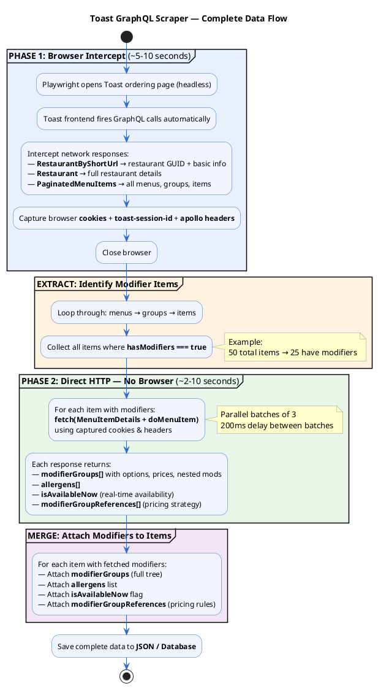

### Current vs New Scraper Flow Comparison

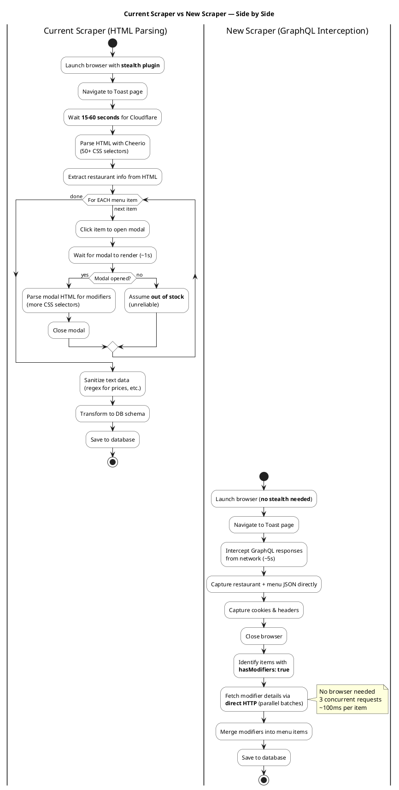

### Data Entity Relationship

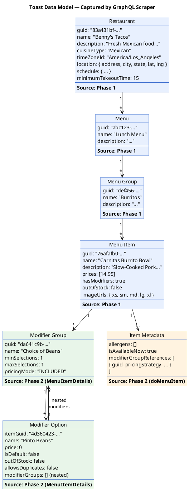

### Modifier Fetch Sequence

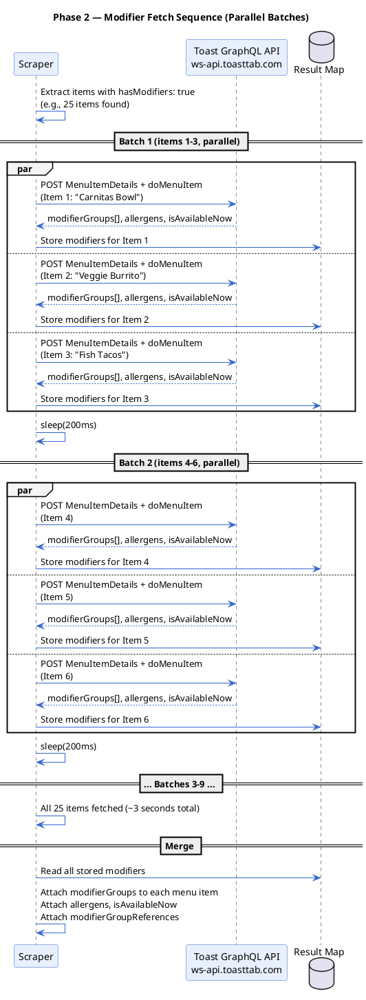

### Lambda Deployment Architecture

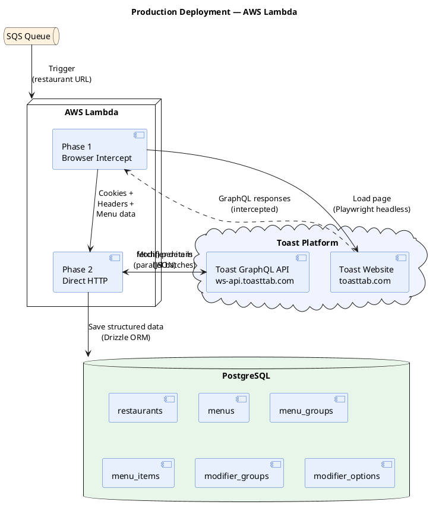

### Implementation Timeline

```plantuml
@startuml
skinparam backgroundColor white

title Implementation Plan — Gantt Chart

project starts 2026-03-10

[Core Scraper (Phase 1 + Phase 2)] as [POC] is 100% completed
[POC] is colored in #4CAF50

[Database Integration] as [DB] lasts 3 days
[DB] starts 2026-03-10
[DB] is colored in #2196F3

[Lambda Handler (SQS)] as [LAMBDA] lasts 2 days
[LAMBDA] starts after [DB]'s end
[LAMBDA] is colored in #2196F3

[Stock Availability Mode] as [STOCK] lasts 1 day
[STOCK] starts after [LAMBDA]'s end
[STOCK] is colored in #FF9800

[Menu Versioning] as [VERSION] lasts 2 days
[VERSION] starts after [STOCK]'s end
[VERSION] is colored in #FF9800

[Testing & Deployment] as [TEST] lasts 2 days
[TEST] starts after [VERSION]'s end
[TEST] is colored in #9C27B0

@enduml
```

---

## Comparison

### Speed

| Scenario | Current Scraper | New Scraper |
|----------|----------------|-------------|
| Restaurant with 50 items, 25 with modifiers | ~60 seconds | ~15 seconds |
| Browser active time | ~60 seconds | ~5 seconds |
| Modifier extraction | Sequential (25 clicks x 1s each) | Parallel HTTP (25 calls in ~3s) |

The new approach is approximately **4x faster** per restaurant.

### Reliability

| Scenario | Current Scraper | New Scraper |
|----------|----------------|-------------|
| Toast redesigns their website UI | All 50+ CSS selectors break. Requires manual inspection and updates to every selector. | No impact. The GraphQL API schema is independent of the UI. |
| Toast adds a new modifier type | May miss the data if the modal HTML structure differs from what we expect. | Automatically captured — the API returns all modifier data regardless of type. |
| Detecting out-of-stock items | If a modal fails to open, we assume the item is out of stock. This is unreliable — the modal could fail for many reasons. | The API returns an explicit `outOfStock` boolean and `isAvailableNow` flag. |
| Nested modifiers (sub-options within options) | Detected but skipped — the HTML parsing cannot reliably extract nested structures. | Fully captured up to 10 levels deep via the `MenuItemDetails` query. |
| Cloudflare protection upgrade | May break — relies on a stealth plugin and specific detection heuristics. | Standard page load — no special tricks needed. |

### Data Quality

| Data Point | Current Scraper | New Scraper |
|------------|----------------|-------------|
| Item price | Extracted from text, requires regex sanitization | Exact numeric value from API (e.g., `14.95`) |
| Modifier price | Parsed from option text like `"Extra Chicken (+$3.00)"` | Exact numeric value (e.g., `3`) |
| Min/max selections | Not reliably extracted | Explicit fields: `minSelections: 1`, `maxSelections: 3` |
| Pricing mode | Not available | Explicit field: `"INCLUDED"` or `"ADJUSTS_PRICE"` |
| Modifier required? | Guessed from HTML | Explicit: `minSelections > 0` means required |
| Allergens | Not extracted | Available per item from API |
| Real-time availability | Unreliable (modal-based guess) | Explicit `isAvailableNow` boolean |
| Item images | Extracted from `` tags, may miss sizes | Full image set: `xs`, `small`, `medium`, `large`, `xl`, `xxl`, `raw` |
| Item GUID | Not available from HTML | Directly from API — enables database FK relationships |

### Infrastructure

| Metric | Current Scraper | New Scraper |
|--------|----------------|-------------|
| Docker image size | 400-600 MB (Chromium + system deps + stealth) | 300-400 MB (Playwright only) |
| Lambda memory requirement | 512 MB - 1 GB | 256 - 512 MB |
| Cold start time | 5-10 seconds | 3-5 seconds |
| External dependencies | playwright-extra, stealth plugin, cheerio, axios | playwright only |
| CSS selectors to maintain | 50+ | 0 |

### Maintenance Burden

**Current scraper** — when Toast updates their UI (which happens regularly):

```
1. Scraper starts failing
2. Developer must inspect Toast's new HTML structure
3. Update 50+ CSS selectors across data-extractor and browser-client modules
4. Test against multiple restaurants to verify
5. Deploy updated scraper
```

**New scraper** — Toast UI updates have zero impact because we read from the API, not the HTML. The only scenario requiring updates is if Toast changes their GraphQL persisted query hashes, which can be re-captured automatically by running the browser intercept once.

---

## Tested Restaurants

The new scraper has been successfully tested across multiple restaurants with different menu sizes and structures:

| Restaurant | Items | Items with Modifiers | Status |
|-----------|-------|---------------------|--------|
| Chiguacle Cevicheria y Cantina | ~30 | ~15 | Working |
| Benny's Tacos (Culver City) | ~50 | ~25 | Working |
| Takoyaki Tanota | ~41 | ~22 | Working |
| Suehiro Chinatown | ~83 | ~52 | Working |

All restaurants returned consistent JSON structure — confirming the API schema is stable across different restaurant configurations.

---

## Risks

| Risk | Likelihood | Impact | Mitigation |
|------|-----------|--------|------------|
| Toast changes persisted query hashes | Low — hashes have been stable across multiple app versions | Modifier fetch fails with 400 errors | Monitor for errors; hashes can be re-captured automatically by running browser intercept |
| Cloudflare blocks headless browsers entirely | Low — this would also break Toast's own monitoring tools | Phase 1 would fail | Same risk as current scraper; residential proxy rotation as mitigation (see below) |
| IP-based blocking at scale | Medium — Lambda uses a limited pool of AWS IPs | Repeated blocks, increased failure rate | Residential rotating proxy (see below) |
| Toast rate-limits the GraphQL endpoint | Medium — we make multiple calls per restaurant | Modifier fetch slows down or fails | Configurable concurrency and delay; can spread requests over time |
| Cookies expire during Phase 2 | Very low — cookies valid for 30+ minutes, Phase 2 completes in seconds | Modifier fetch returns errors | Detect expiration and re-run Phase 1 to get fresh cookies |
| Toast deprecates persisted query operations | Very low — these are core to their own frontend | Entire approach would need updating | Would also break Toast's own website; migration would be visible in advance |

---

## Residential Rotating Proxy

At scale, Lambda functions run from a limited pool of AWS IP addresses. Anti-bot systems like Cloudflare can detect and block datacenter IPs, especially when multiple requests originate from the same IP range in a short period. Residential rotating proxies route each request through a different residential IP address, making traffic appear as regular consumer browsing.

This is a nice-to-have for the current stage, but will be needed when scraping at scale (hundreds or thousands of restaurants per run).

### How It Works

Both Phase 1 (browser) and Phase 2 (HTTP) route through the same proxy within a single scrape cycle. Since our input is a single restaurant URL/slug per Lambda invocation, all requests for that restaurant go through one rotating proxy session — ensuring consistent IP behavior for Cloudflare while still rotating across different Lambda invocations.

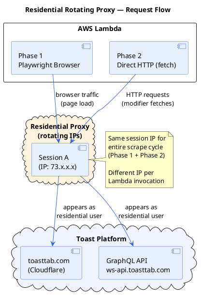

### Without vs With Proxy — At Scale

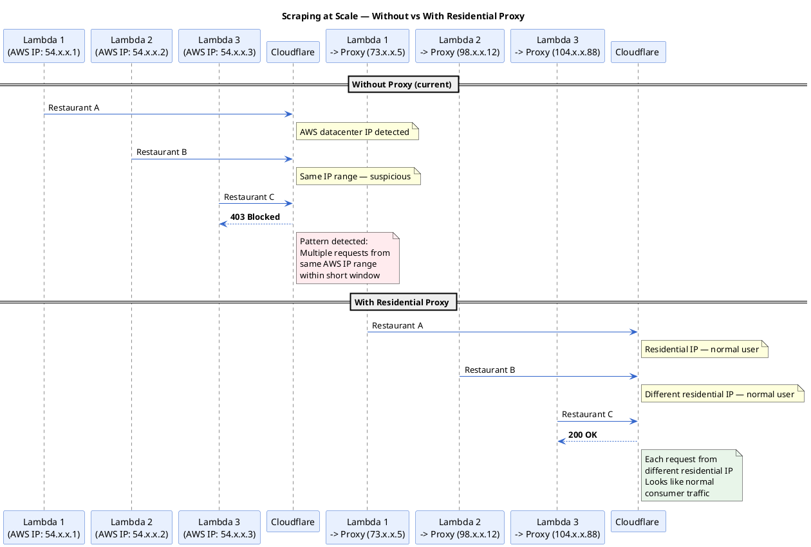

### Integration Points

Residential proxy configuration would be applied at two points:

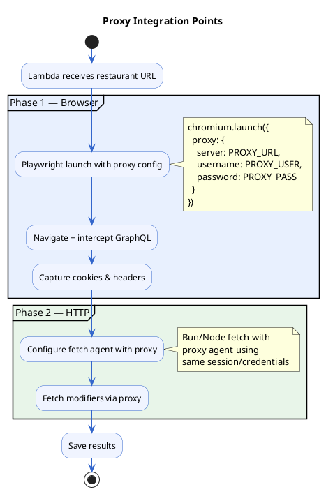

### Provider Landscape

Several residential proxy providers exist in the market:

| Provider | Pool Size | Pricing Model |
|----------|-----------|---------------|
| Bright Data | 72M+ IPs | Per GB / per request |
| Oxylabs | 100M+ IPs | Per GB |
| SmartProxy | 55M+ IPs | Per GB |
| IPRoyal | 32M+ IPs | Per GB / pay-as-you-go |
| NetNut | 85M+ IPs | Per GB |
| Soax | 8.5M+ IPs | Per GB / per port |

### Priority

| Stage | Need | Status |
|-------|------|--------|
| Development / PoC | Not needed | Current |
| Small-scale production (<100 restaurants/day) | Nice to have | Planned |
| Scale production (1000+ restaurants/day) | Required | Future |

---

## Error Handling Strategy

Based on lessons learned from the old scraper ([error handling audit](../docs/error-handling-scraper-old.md)), the new scraper implements a **two-layer retry strategy** matching the old scraper's proven pattern, while fixing gaps that were never addressed.

### Two-Layer Retry Architecture

The scraper uses two independent retry mechanisms that work in sequence — exactly like the old scraper, but with improvements at each layer.

**Layer 1 (internal):** Retry within the same Lambda invocation — fast, no cold start overhead, uses the same cookies/session.

**Layer 2 (SQS re-queue):** If the entire invocation fails, SQS sends the message to a new Lambda — fresh browser, fresh cookies, fresh internal retries.

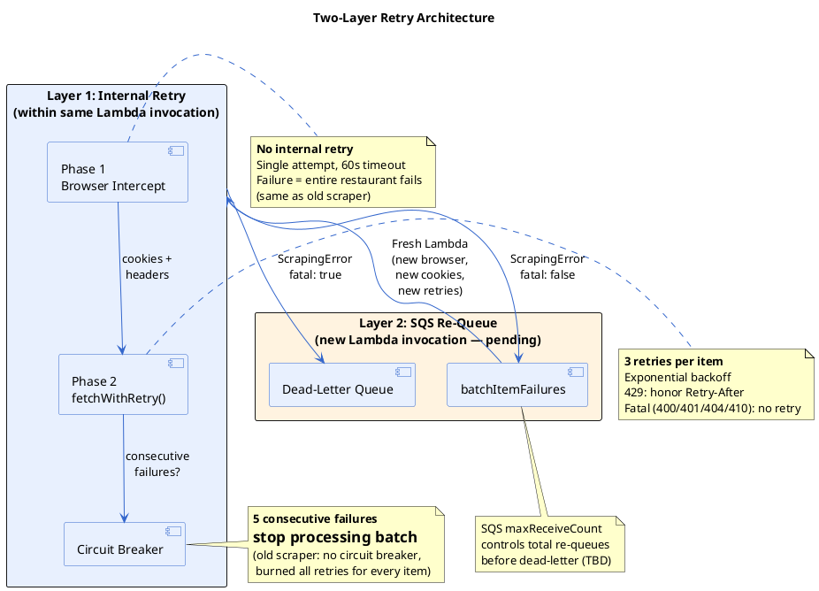

### HTTP Status Code Decision Tree

How each HTTP status code is handled during Phase 2 modifier fetches:

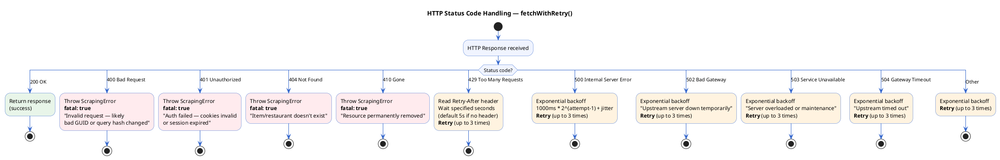

### Error Handling Comparison Table

| # | Capability | Old Scraper | New Scraper | Notes |
|---|-----------|-------------|-------------|-------|
| — | Fatal status detection (400/401/404/410) | Have | Have | Same behavior |
| — | Retry with exponential backoff | Have (HTTP client) | Have (fetchWithRetry) | Same formula: base * 2^n + jitter, cap 30s |
| — | Per-URL/item error isolation | Have | Have | Old: per-URL. New: Promise.allSettled per item |
| — | Rate limiting between requests | Have | Have | Old: configurable limiter. New: 200ms batch delay |
| 1 | 429 handling with Retry-After | **Missing** | **Fixed** | Old fell into generic retry path |
| 2 | 5xx distinction | **Missing** | **Fixed** | Old treated all 5xx identically |
| 3 | Browser retry on failure | **Missing** | Missing | Neither scraper retries Phase 1 — single attempt |
| 5 | Browser cleanup on error | **Missing** | **Fixed** | finally block prevents Chromium leaks |
| 6 | Circuit breaker | **Missing** | **Fixed** | 5 consecutive failures = stop batch |
| 7 | ScrapingError as real class | **Missing** (plain object) | **Fixed** | Proper Error subclass with stack trace |
| 11 | Response body in errors | **Missing** | **Fixed** | Truncated 500 chars for CloudWatch |
| — | Phase 1 data validation | **Missing** | **Fixed** | Validates session headers + menu structure |
| — | SQS batchItemFailures re-queue | Have | **Pending** | Needs Lambda handler (approval required) |
| — | DB connection retry + pooling | Have | **Pending** | Needs DB integration |
| — | Zod schema validation (Lambda input) | Have | **Pending** | Needs Lambda handler |
| — | 403 anti-bot handling | Have | N/A | New scraper doesn't hit anti-bot (no stealth needed) |

### Old vs New Scraper — Error Handling Comparison

```plantuml
@startuml
skinparam backgroundColor white
skinparam defaultTextAlignment center

title Error Handling Comparison — Old Scraper vs New Scraper

legend top left
  | Color | Meaning |
  |<#E8F5E9>| Have (both scrapers) |
  |<#E3F2FD>| Fixed in new scraper |
  |<#FFF3E0>| Pending (needs Lambda handler) |
  |<#FFEBEE>| Old scraper gap (never fixed) |
endlegend

|Old Scraper|New Scraper|

|Old Scraper|
start
:HTTP Client retry;
note right
  3 retries, exponential backoff
  base * 2^(attempt-1) + jitter
  cap at 30s
end note
#E8F5E9:Fatal status detection
(400, 401, 404, 410);
#E8F5E9:403 anti-bot handling
(15-25s delay);
#FFEBEE:No 429 handling
(issue #1);
#FFEBEE:No 5xx distinction
(issue #2);
#FFEBEE:No browser retry
(issue #3);
#FFEBEE:No browser cleanup (finally)
(issue #5 — Chromium leaks);
#FFEBEE:No circuit breaker
(issue #6 — burns all retries);
#FFEBEE:ScrapingError is plain object
(issue #7 — no stack trace);
#FFEBEE:No response body in errors
(issue #11 — hard to debug);
#E8F5E9:Per-URL error isolation;
#E8F5E9:SQS batchItemFailures re-queue;
#E8F5E9:DB connection retry + pooling;
stop

|New Scraper|
start
:fetchWithRetry();
note right
  3 retries, exponential backoff
  1000ms * 2^(attempt-1) + jitter
  cap at 30s
end note
#E8F5E9:Fatal status detection
(400, 401, 404, 410);
#E3F2FD:429 handling
(honors Retry-After header);
#E3F2FD:5xx retried with backoff
(distinguishes server errors);
#E3F2FD:Browser cleanup via finally
(always closes Chromium);
#E3F2FD:Circuit breaker
(5 consecutive failures = stop);
#E3F2FD:ScrapingError class
(real Error, fatal flag, stack trace);
#E3F2FD:Response body in errors
(truncated 500 chars for CloudWatch);
#E3F2FD:Phase 1 data validation
(session headers + menu structure);
#E8F5E9:Per-item error isolation
(Promise.allSettled);
#FFF3E0:SQS batchItemFailures re-queue
(pending — needs Lambda handler);
#FFF3E0:DB connection retry + pooling
(pending — needs DB integration);
stop

@enduml
```

### Internal Retry Flow (Phase 2 — Implemented)

Each modifier fetch retries within the same Lambda invocation before giving up. This matches the old scraper's HTTP client pattern.

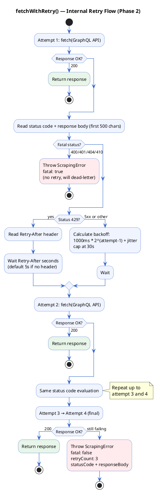

### Circuit Breaker (Phase 2 — Implemented)

Prevents burning Lambda time when Toast's API is down. The old scraper had no circuit breaker — a batch of 50 items would produce 200 failed requests (50 x 4 attempts each).

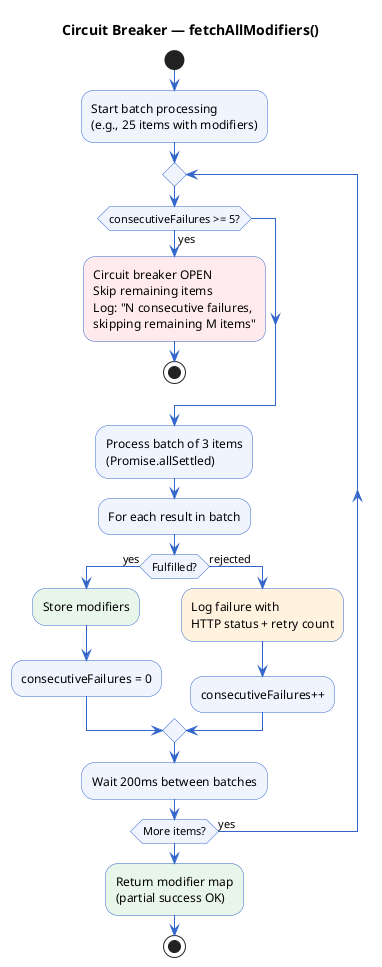

### Browser Cleanup (Phase 1 — Implemented)

The old scraper had no `finally` block (issue #5). A mid-scrape error leaked the Chromium process, eating Lambda memory until the container died.

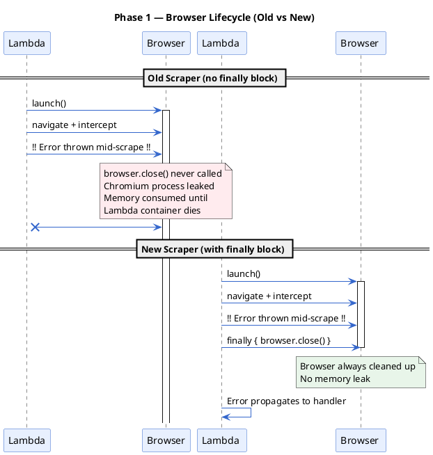

### Cookie Lifetime

Toast cookies live ~30 minutes. Our max Lambda invocation is 15 minutes. Cookies captured in Phase 1 are always valid through Phase 2 — no persistence or refresh logic needed.

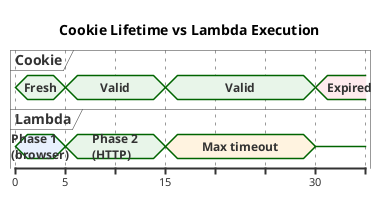

### SQS Re-Queue Strategy (Pending Implementation)

The second retry layer is **SQS-based re-queuing**, matching the old scraper's `batchItemFailures` pattern. This is not yet implemented — it requires the Lambda handler, which needs approval and further review.

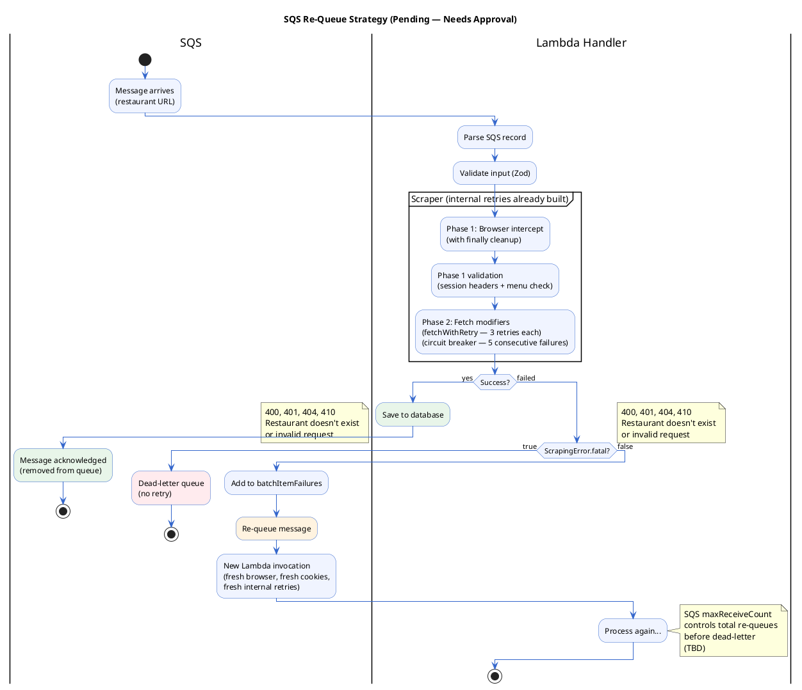

Key design decisions for the handler (to be finalized):

- **Per-record isolation**: Each SQS record processed independently; one failure doesn't stop the batch
- **Fatal vs retryable**: The `ScrapingError.fatal` flag drives the re-queue decision — 404 (restaurant doesn't exist) goes to dead-letter, 503 (server down) gets re-queued
- **SQS max receive count**: Controls how many times a message is re-queued before going to dead-letter (TBD, old scraper used SQS defaults)

### End-to-End Error Scenarios

What happens when things go wrong at each stage:

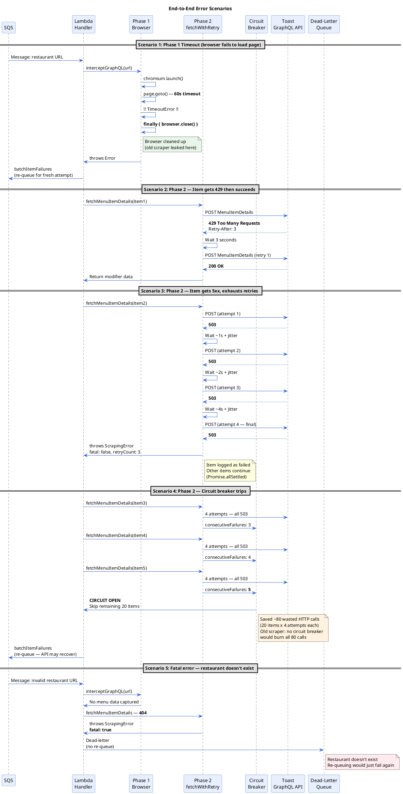

### Exponential Backoff Timing

Visual comparison of retry timing for a 5xx error across all 3 retries:

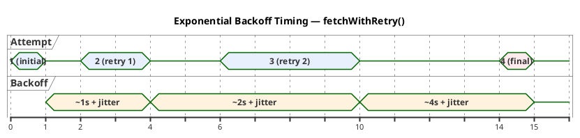

| Attempt | Delay Before | Formula | Worst Case |
|---------|-------------|---------|------------|
| 1 | 0ms (immediate) | — | — |
| 2 | ~1-2s | 1000 * 2^0 + jitter | 2s |
| 3 | ~2-3s | 1000 * 2^1 + jitter | 3s |
| 4 (final) | ~4-5s | 1000 * 2^2 + jitter | 5s |
| **Total** | | | **~10s max per item** |

With circuit breaker at 5 consecutive failures: worst case is 5 items x 10s = **~50 seconds** before the scraper gives up on the batch — well within the 15-minute Lambda timeout.

---

## Implementation Plan

| Phase | Task | Effort |
|-------|------|--------|
| 1 | Core scraper (Phase 1 + Phase 2) | Done (proof of concept complete) |
| 2 | Database integration — map GraphQL response to existing schema (restaurants, menus, menu_groups, menu_items, modifier_groups, modifier_options) | 2-3 days |
| 3 | Lambda handler — SQS-triggered, matching existing deployment pattern | 1-2 days |
| 4 | Stock availability mode — lightweight check using `outOfStock` + `isAvailableNow` | 1 day |
| 5 | Menu versioning — diff current vs previous menu, only save if changes detected | 1-2 days |
| 6 | Testing and deployment | 1-2 days |

**Total estimated effort: 1-2 weeks**

---

## FAQ

### Are prices up to date?

**Yes.** Prices come directly from Toast's GraphQL API — the same source that powers their live ordering page. When a restaurant updates a price in Toast, the next scrape will capture the updated value. Prices are returned as exact numeric values (e.g., `10.9`, `14.95`), not parsed from text.

### How do we map/identify entities across scrapes?

Every entity from the API has a **stable GUID** and a **name**. We can use either or both for mapping:

| Entity | GUID Example | Name Example |
|--------|-------------|-------------|
| Menu | `5aa06c1c-8f6d-4ea6-ad11-fd9843eeed62` | `"Tanota To-Go"` |
| Menu Group | `5f95a3dd-d819-4391-8904-7c3faa3261ac` | `"Takoyaki"` |
| Menu Item | `89a00e49-da76-4595-b6d7-f23ad1f8e34a` | `"Original 8"` |
| Modifier Group | `7dafb655-f33a-40d3-af32-e0ede02617ba` | `"Takoyaki Extra Topping"` |
| Modifier Option | `73ec8c5d-0a2b-4185-9e49-713cf4ace764` | `"Green onion"` |

**Recommended mapping strategy:** Use the **GUID as primary key** for matching. GUIDs are unique and stable — even if a restaurant renames an item (e.g., `"Original 8"` → `"Classic Takoyaki 8pc"`), the GUID stays the same. Names can be used as a secondary/display field.

This is a significant improvement over the current scraper, which does not have access to GUIDs from HTML parsing and must rely on name matching (which breaks on renames).

### When a new menu/item is found, what status does it get?

**Default to `pending`.** This is consistent with the existing scraper behavior — all newly inserted entities (restaurants, menus, menu groups, menu items, modifier groups, modifier options) are created with `status: 'pending'`. They require manual review/approval before going live.

### What happens when an existing menu item in the DB is missing from Toast?

**TBD — needs product decision.** Options to consider:

1. **Mark as `archived`** — if the item is no longer on Toast's menu, set its status to `archived` in our DB. This preserves the record but hides it from active use.
2. **Mark as `out_of_stock`** — if we want to keep it visible but indicate it's currently unavailable.
3. **Do nothing** — keep the item as-is and only update items that are still present. This avoids accidental data loss if Toast has a temporary API issue.
4. **Soft-delete with timestamp** — mark with a `removed_at` timestamp so we can track when items disappeared and potentially restore them if they reappear.

**Recommendation:** Option 1 (mark as `archived`) with a grace period — if an item is missing from 2+ consecutive scrapes, archive it. A single missing scrape could be a temporary Toast issue.

### What if Toast changes their persisted query hashes?

The hashes are SHA256 identifiers for pre-registered GraphQL queries on Toast's server. They have been stable across multiple app versions. If they change:

1. The scraper will receive 400 errors from the API
2. We re-run the browser intercept (Phase 1) to capture the new hashes from Toast's frontend
3. Update the hash values in our code
4. This can be automated — the intercept already captures hashes from outgoing requests

### Does this approach violate Toast's Terms of Service?

We are accessing the same public API that any browser visitor accesses when they view a restaurant's ordering page. We are not bypassing authentication, brute-forcing endpoints, or accessing private data. The data we capture (restaurant info, menus, prices) is publicly visible on Toast's website.

### Can we scrape multiple restaurants in parallel?

**Yes.** Each restaurant gets its own browser session (Phase 1) and its own set of cookies. Multiple restaurants can be scraped concurrently, limited only by Lambda concurrency settings and rate limiting considerations.

### How does this handle restaurants with very large menus?

The `PaginatedMenuItems` query returns all items in one response — we have tested restaurants with 80+ items and it works without pagination. The API supports pagination (`offset` parameter) if needed, but so far all tested restaurants return the complete menu in a single call.

### What data do we get that the old scraper couldn't capture?

| Data | Old Scraper | New Scraper |
|------|-------------|-------------|
| Nested modifiers (sub-options within options) | Skipped | Captured up to 10 levels |
| `pricingMode` (`INCLUDED` vs `ADJUSTS_PRICE`) | Not available | Available |
| `minSelections` / `maxSelections` | Unreliable | Exact values |
| Allergens per item | Not captured | Available |
| `isAvailableNow` (real-time) | Guessed from modal | Explicit boolean |
| Item/modifier GUIDs | Not available from HTML | All entities have GUIDs |
| `outOfStock` per modifier option | Not captured | Available |
| Image URLs (all sizes) | Partial | Full set (xs to xxl) |

### What happens if Cloudflare blocks us?

Same risk as the current scraper — both approaches need a browser for the initial page load. However, the new scraper has an advantage: it only needs the browser for ~5 seconds (vs ~60 seconds for the old scraper), which reduces the window of exposure to Cloudflare detection. We also don't need the stealth plugin since we're not doing suspicious activity (no rapid clicking, no modal automation).

---

## Conclusion

The GraphQL interception approach is faster, more reliable, captures more data, and requires less maintenance than the current HTML parsing approach. It eliminates the most fragile parts of the current system (CSS selectors, modal clicking, text sanitization) while providing cleaner, more complete data from the source API.

The core proof of concept is already working and has been tested across multiple restaurants with consistent results. The remaining work is database integration and Lambda deployment, both of which can follow the existing patterns from the current scraper.
